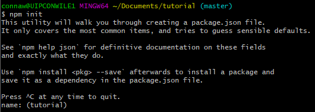
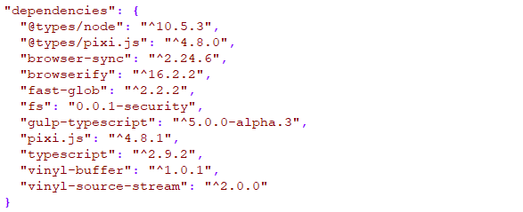
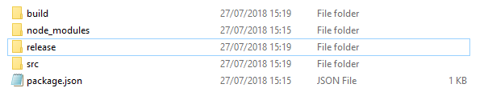
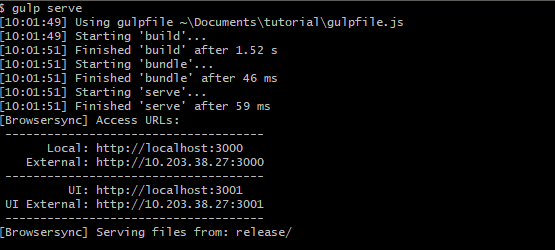
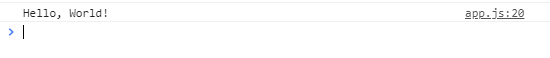

# Best Tutorial You've Ever Seen In Your Life
### TypeScript + Pixi.js + Gulp + Browserify + Browser-Sync


## Introduction

This tutorial will show you how to build a project for HTML5, using TypeScript with Pixi.js. We'll use Gulp to build it, Browserify to bundle it, and Browser-Sync to serve it up.

Node.js is a JavaScript runtime for creating projects in JS, with a built-in set of libraries.

NPM is its dependency manager, each project has a `package.json` that lists its dependencies which it will install and manage versions for.

## Initializing Your Project

Install Node.js using the following link:  
[https://nodejs.org/dist/v8.11.3/node-v8.11.3-x64.msi](https://nodejs.org/dist/v8.11.3/node-v8.11.3-x64.msi)

Create a new folder where you would like your project to live. For this tutorial we'll create a folder called `tutorial/`.

Navigate to the `tutorial/` folder, and open up a terminal window inside, if you have `Git` installed you can right-click and choose `Git Bash Here`. Otherwise you can simply run `cmd` and `cd` to your `tutorial/` folder.

Now, run `npm init` to initialize your project.



Keep pressing `enter` until you have exhausted all of the options it gives you. If you want, you can actually fill these out with your own choices, but the default ones are okay for this tutorial.

Once you're done, you'll see a brand new `package.json` in your folder.

## Installing Dependencies

First of all, you'll want to install `Gulp` globally. When you `npm install` a package, it installs to the project of the folder you're currently in. If you add the `-g` flag then it will install that package globally on your machine, so that you can use its command-line interface anywhere.

To do this, simply run `npm install -g gulp` and wait for it to install.

Once that's done, you can start to install the packages we're going to need for this tutorial.

For each package listed below, you're going to want to run the following command:

`npm install --save <package-name>`

The `--save` flag tells NPM that you want to add the package to your `package.json`'s dependencies (which you do!)

Go ahead and install the following packages:

* @types/pixi.js
* @types/node
* vinyl-source-stream
* vinyl-buffer
* gulp-typescript
* typescript
* browserify
* browser-sync
* fast-glob
* pixi.js
* fs

Your `package.json`'s dependencies should now look something like this:



Don't worry about the version numbers, they may be updated by the time you follow this tutorial. The latest versions should be fine, but if anything doesn't work, you may want to try using the versions from the image above. If you change any version manually in the `package.json`, you'll have to run an `npm install` afterwards to update your dependencies.

## Folder Structure

You'll want to create a folder for your source code (`src/`), and a folder for your transpiled JavaScript (`build/`) and finally a folder for your final release output (`release/`). You can call these whatever you want, if you don't like these names, just make sure that when following the tutorial later you substitute them out with what you chose.

You should have something that looks like this:



## TypeScript Entry Point

You'll now want to create an entry point for TypeScript. This will contain the first code that will be run in your game. So go ahead and create a file called `main.ts` in your `src/` folder and then *open it up in VS Code*.

For now, just write the following code in the file and save it:
```typescript
console.log("Hello, World!")
```

## Get Your Build On

To actually turn this TypeScript into JavaScript that the browser can understand, we'll create a `Gulp` task to transpile it for us and then use `Browserify` to bundle it up into one neat .js file.

To start with, we'll need an entry point for `Gulp`, so go ahead and create a `gulpfile.js` at the root of your project.

To create a `build` task you'll want the following code. It is commented so you can understand a bit more about what is going on:

```javascript
// Import gulp, our gulp-typescript library, and the fs (file system) package.
var gulp = require("gulp");
var tsc = require("gulp-typescript");
var fs = require("fs");

// Create a TypeScript project using the tsconfig.json at the root of your project.
var project = tsc.createProject("tsconfig.json");

// This defines a new gulp task, we'll call our build task, `build` because it makes sense.
gulp.task("build", function(done) {
	// Define an array of source file locations. We'll just use every .ts file in src/.
    var gameSrc = ["src/**/**.ts"];
	
	var builder = gulp.src(gameSrc)
	// Build the project using our TypeScript project defined above.
    .pipe(project())
	// Grab the outputted .js for the current file we're building.
    .js
	// Throw it into our build/ directory.
    .pipe(gulp.dest("build/"));
	
	// Return the builder, the task will finish when it's done!
	return builder;
});
```

Now, when you run the `gulp build` command, all of your TypeScript source will be transpiled down to JavaScript and thrown into your `build/` folder. Check it out!

## Everyday I'm Bundling

Now that you've got your transpiled JavaScript, we need to use `Browserify` to bundle it up so that a browser can understand it.

Again, I'm just going to show the code required to create a `bundle` task here, and comment it so you can understand the process. You'll want to put the code at the bottom of your `gulpfile.js` underneath the `build` task you just made.

```javascript
// Import the browserify package. Put this at the top with your other `require` statements.
var browserify = require("browserify");

// Import the source stream and buffer packages.
var source = require("vinyl-source-stream");
var buffer = require("vinyl-buffer");

// Define the `bundle` task. The `["build"]` bit tells Gulp that you want that task to run first!
gulp.task("bundle", ["build"], function(done) {
	var outputFolder = "release/";
	var outputFileName = "js/app.js";
	var mainTsFilePath = "build/main.js";
	
    var bundler = browserify({
		paths: ["./build"],
		debug: false,
		standalone: outputFileName
    });

	// Add the main.ts file to the bundler and start bundling now...
    var output = bundler.add(mainTsFilePath).bundle()
	// Specify our target output file name...
	.pipe(source(outputFileName))
	.pipe(buffer())
	// Specify out output folder.
	.pipe(gulp.dest(outputFolder));
	
	// Return the output so that the task will finish when it's done.
	return output;
});
```

Great! Now run the `gulp bundle` command and you'll see that it will first run the `build` task automatically, and then afterwards it will bundle up your built .js files and place a single browser-compatible .js file at `release/js/app.js`.

## Serve It Up

Now that you can write TypeScript, transpile it down to JavaScript and bundle it into a single .js file compatible with the browser; it's time serve it up in the browser so you can test it.

To do this, you'll need to write a `serve` task. You don't need to have a task like this, but it will spin up a web server for you and serve the content in your `release/` directory. If you want to use your own web server, you can skip this step entirely.

### Site Index

First, start by creating an `index.html` file in your `release/` directory and have it load in your `app.js` like so:

```html
<script src="js/app.js"></script>
```

This will be the entry point when the site is navigated to, and will simply load in your .js file. You can of course put any other HTML in here or just add the script tag to an existing site.

### Serve Task

Add the following code to your `gulpfile.js`, I've gone ahead and added comments again to help give a better understanding of what is happening:

```javascript
// Import the browser-sync package. Put this at the top with your other `require` statements.
// The browser-sync package will let you spin up a web server easily.
var browserSync = require("browser-sync");

// Define the `serve` task. The `["bundle"]` bit tells Gulp that you want that task to run first!
gulp.task("serve", ["bundle"], function(done) {
	var outputFolder = "release/";
	
	// Spin up the server from our release/ directory.
	// You can read the BrowserSync documentation for more information about these options.
	browserSync.init({
		server: {
			baseDir: outputFolder
		},
		codeSync: false,
		online: true,
		cors: true
	});
	
	// Tell our Gulp task that we're done, we don't return a stream here like the other tasks.
	done();
});
```

And that's all there is to it. You can run `gulp serve` and it will first build your game, then bundle it, and then finally serve it up. You'll now be able to access it at `localhost:3000` (by default.)



Now when you navigate to `localhost:3000` you should see our "Hello, World!" in the JavaScript console!



## Rendering with Pixi.js

Now that you've got your basic build, bundle, and serve tasks setup; you can start using Pixi.js to render your game!

In this tutorial I'll get you rendering a simple image onto the screen. Pixi.js will use WebGL by default, and if the browser doesn't support it, it will fall back to Canvas.

Start by placing a `.png` file of your choice in `release/images/` and call it `image.png`.

Now, open up `main.ts` and import the Pixi.js package:

```typescript
import * as PIXI from "pixi.js"
```

First of all, we need to create the PIXI renderer, for this we'll use the `PIXI.Application` class which will decide for us whether we will be using WebGL or Canvas and provide us with a stage to add our display objects to:

```typescript
// Auto detect which renderer we should use (WebGL or Canvas) and set our width and height (1280x720 for this tutorial).
// You could create the renderer manually, but the Pixi.js application class helps with setup.
let app = new PIXI.Application(1280, 720);

// When the window has loaded, add the view to the DOM.
window.onload = () => {
    document.body.appendChild(app.view);
};
```

Now we'll create a new asset loader, we'll use this to load in our `image.png`.

```typescript
// Create a new asset loader, a PIXI helper class for loading our images and other assets.
let loader = new PIXI.loaders.Loader();
```

Now we'll load in our `image.png` and PIXI will tell us when it has been fully loaded:

```typescript
// Load our image.png, and give it the name "image" which we'll later refer to it by.
loader.add("images/image.png");

loader.load(() => {
    // This callback is called when all of our assets are loaded.
});
```

Now we're going to create our `Sprite`, so update the load callback to look like this:

```typescript
loader.load(() => {
    // This callback is called when all of our assets are loaded.

    // Create a new sprite with our image.
    let sprite = new PIXI.Sprite();

    // Set the sprite's texture to our loaded image. PIXI automatically adds
    // it to the `TextureCache` with the name we gave it earlier.
    sprite.texture = PIXI.utils.TextureCache["image"];

    // Add the sprite to our stage (contained within our PIXI.Application object).
    app.stage.addChild(sprite);
});
```

## Final Code

Now you run the `gulp serve` command and you should see your image rendered to the page!

Below you can find the final `main.ts` code, in case you got lost on the way:

```typescript
import * as PIXI from "pixi.js";

let app = new PIXI.Application(1280, 720);

window.onload = () => {
    document.body.appendChild(app.view);
};

let loader = new PIXI.loaders.Loader();
loader.add("image", "images/image.png");

loader.load(() => {
    let sprite = new PIXI.Sprite();
    sprite.texture = PIXI.utils.TextureCache["image"];
    app.stage.addChild(sprite);
});
```

## Extra Credit

**The following is not neccessary for this tutorial!**

Because we're using the `PIXI.Application` class, it will internally handle the render loop for us. If we decided to manually create the renderer then we would need to do something like the following:

At the bottom of the file, underneath the `load` method, we'll create a function called `render` that will be called every frame so that we can render our stage to the canvas.

```typescript
// Define a function that will be called every frame to render our stage.
function render() {
    // Request a new animation frame, and call this method when its ready.
    // This will effectively create a loop, so that `render` is called every frame.
    requestAnimationFrame(render);

    // Render the stage!
    app.renderer.render(app.stage);
}

// Call the render function immediately to get the render loop going.
render(); 
```